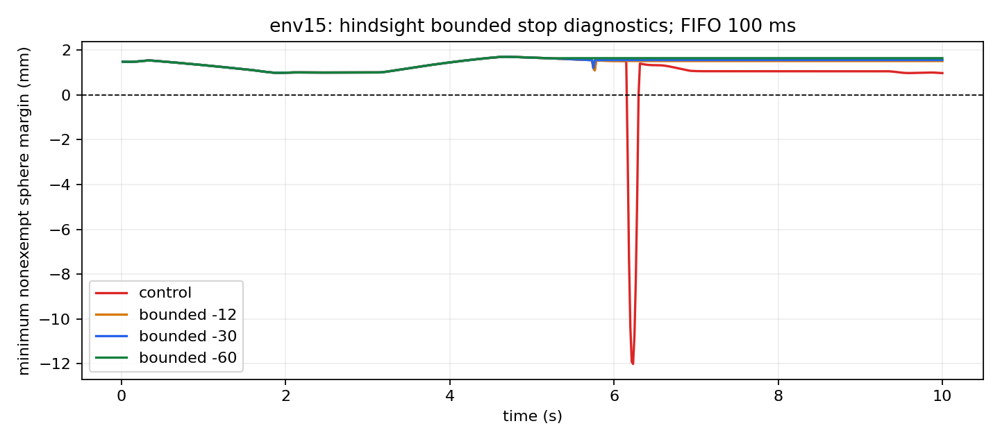

# 限幅停止与独立进程评测

遵守原输出限幅、仍等待100ms FIFO：未干预7/32重叠；事后停止提前12步 1/32；30步 1/32；60步 1/32。每条件独立启动，属于制动诊断。

四组实际目标在浮点容差内遵守原增量箱，严格6步FIFO逐位核验通过；17/18条干预前观测前缀与控制逐位一致。12/30/60步探针全环境分别1/32、1/32、1/32重叠。该结果用于判断在这些已知失败轨迹中，限幅停止是否可行。利用事后失败时刻的改善不构成System 0前瞻安全性能；未干预失败与新增失败完整保留。尚需研发并验证能及时触发的检测器、停止动作与距离约束的兼容性，再扩大种子、操作空间和物体任务。无接触力、连续碰撞或实机证据。

seed12 · 32环境×10秒 · ±0.3rad初态 · 纯随机保持90步（1.5秒）· 幅度0.015rad/步。actor权重和critical-only规则冻结；每个条件独立新进程且仅一个cell，初态和完整命令逐位匹配。实际目标每步限幅0.024999rad（浮点容差5e-7rad），全部FIFO和软限位核验通过。触发表来自历史失败，六个环境干预、env31未干预；没有前瞻检测器。探针停止目标未经过原距离行投影，仅验证增量箱和软限位；不推广生产控制。32对照+96事后诊断窗口相关，未增加独立安全样本；测量仅控制周期末非豁免球距。

|条件 / 提前量|全环境重叠|干预环境重叠|未干预失败|新增失败|最小非豁免球距|最大实际目标增量|
|---|---:|---:|---|---|---:|---:|
|未干预|7/32|—|[12, 13, 15, 22, 28, 30, 31]|[]|-28.128mm|0.024999rad|
|12步（200ms）|1/32|0/6|[31]|[]|-0.101mm|0.024999rad|
|30步（500ms）|1/32|0/6|[31]|[]|-0.101mm|0.024999rad|
|60步（1000ms）|1/32|0/6|[31]|[]|-0.101mm|0.024999rad|

## 各条停止轨迹

|提前量|env|观测前缀一致|触发/首消息到达/固定目标全部到达(step)|到达前/后重叠|旧目标偏差|
|---|---:|---|---|---|---:|
|12|12|True|437/443/466|False/False|0.588272rad|
|12|13|True|172/178/187|False/False|0.246257rad|
|12|15|True|357/363/371|False/False|0.215114rad|
|12|22|True|375/381/389|False/False|0.216496rad|
|12|28|True|548/554/562|False/False|0.210799rad|
|12|30|False|446/452/459|False/False|0.185667rad|
|30|12|True|419/425/437|False/False|0.307334rad|
|30|13|True|154/160/169|False/False|0.245468rad|
|30|15|True|339/345/353|False/False|0.212546rad|
|30|22|True|357/363/372|False/False|0.226390rad|
|30|28|True|530/536/546|False/False|0.257602rad|
|30|30|True|428/434/441|False/False|0.190966rad|
|60|12|True|389/395/402|False/False|0.195251rad|
|60|13|True|124/130/139|False/False|0.231688rad|
|60|15|True|309/315/323|False/False|0.221296rad|
|60|22|True|327/333/341|False/False|0.223316rad|
|60|28|True|500/506/516|False/False|0.254319rad|
|60|30|True|398/404/411|False/False|0.198059rad|

## 可复核证据与边界

- 预登记三种提前量和同六个环境；全32环境逐条结果见 all_environments.csv，协议和聚合结果随报告发布。未给env31增补事后触发，没有剔除未干预失败。
- 原始NPZ保留在本地实验目录；网页发布协议、全部episode JSON、汇总、CSV和逐帧曲线，没有上传完整原始NPZ。
- 17项CPU契约通过。RED为限幅功能缺失的导入失败，随后固定采样、限幅/软限位、真实FIFO和真实子进程隔离检查GREEN；未声称所有契约均单独对旧实现完成RED。
- 输出箱上限0.024999rad/步，浮点容差5e-7rad；核验实际 controller_target，exec是覆盖前求解器输出，不能用它冒充实际停止动作。
- 独立启动工具拒绝覆盖旧输出，拒绝未完成或多cell子进程，失败则停止后续条件并保留日志/协议。隐藏重置状态原因尚未定位，独立进程只隔离前序条件。
- 当前控制对旧冷启动控制六项全轨迹逐位一致=True。源码差异为先前已记录的可视化文件；当前四组源快照、解析配置、actor和协调器逐项相同。
- 没有修改生产安全核心或学习权重。探针遵守速度箱、软限位和FIFO，但未重新投影原距离约束，仅为机制验证；不能按此直接发布默认控制策略。
- 32控制+96诊断窗口相关，actor/输入重复。不得加到历史512或其他批次构造独立安全置信界；新增独立安全窗口计为0。
- 限幅停止是缓慢向一次采样的实测q移动，并非真实关节立即静止；非受控手部关节不保证停机。无物体/接触力/连续碰撞/实机结果。
- 下一步：建立可前瞻触发的队列与制动裕量检测，验证距离约束兼容性和新种子配对对照；完善全四臂操作范围覆盖。

