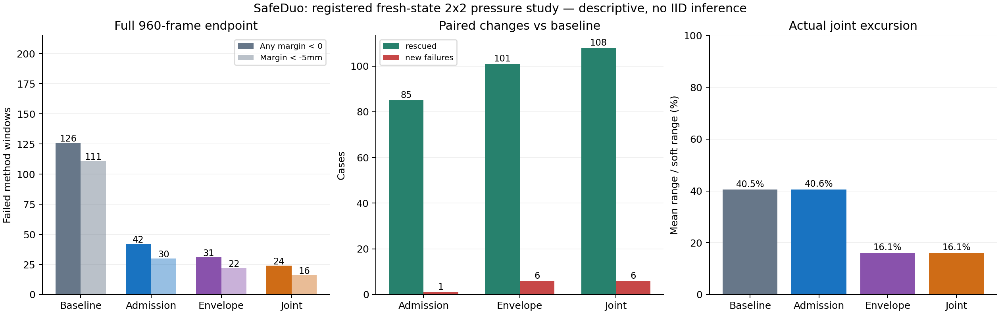

# 新初态四格配对实验

完成方法窗口 **768/768**；无效窗口 **0**。
初态资格库有192个全新初态；实际四方法完整配对案例192个。
本批为条件化风险样本，不能解释为总体可靠性或完整26维空间覆盖。硬件状态保持未批准。

| 方法 | 违规/完成 | 深违规 | 最差裕度mm | cross/F自碰/U自碰/桌面 | 四臂移动 | 执行/输入L2 |
|---|---:|---:|---:|---|---:|---:|
| 原基线＋数值门 | 126/192 | 111 | -70.524089 | 6/30/52/101 | 43.676% | 0.570225 |
| 预测准入 | 42/192 | 30 | -39.435066 | 0/1/4/39 | 42.870% | 0.563292 |
| 积压限制 | 31/192 | 22 | -47.780961 | 2/1/5/27 | 45.681% | 0.204967 |
| 两者组合 | 24/192 | 16 | -18.908963 | 1/0/1/23 | 44.510% | 0.203927 |

违规以原始非豁免几何裕度<0判定，未加入容差；深违规阈值为−5mm。类别可在同一窗口重叠。
运动统计从第60步开始；每臂每帧关节位移L2>0.001rad才记移动。执行/输入L2是逐帧范数和的比率，不是搬运成功率。

组合方法的实际平均关节路径为50.979rad，基线为124.392rad；平均窗口关节范围为自身软限位的16.143%与40.528%。违规改善伴随实际运动范围下降，仍需匹配运动强度和任务完成门验证。

## 配对救回与新增失败

| 对照→候选 | 完整配对案例 | 救回 | 新增失败 | 都失败 | 都无违规 |
|---|---:|---:|---:|---:|---:|
| 原基线＋数值门→预测准入 | 192 | 85 | 1 | 41 | 65 |
| 原基线＋数值门→积压限制 | 192 | 101 | 6 | 25 | 60 |
| 原基线＋数值门→两者组合 | 192 | 108 | 6 | 18 | 60 |
| 预测准入→两者组合 | 192 | 33 | 15 | 9 | 135 |
| 积压限制→两者组合 | 192 | 10 | 3 | 21 | 158 |

救回只表示这16秒离散球模型窗口由违规变为无违规。全960帧判定；图表抽样额外保留各类最小值及首个违规帧。
四格二元失败交互Y11−Y10−Y01+Y00的分组和：27 / 27 / 23。仅描述本批结果。

### 相对原基线的全部新增失败

| 输入种子/环境 | 方法 | 首个违规帧 | 深违规 | 四类最小mm |
|---|---|---:|---|---|
| 1701627244/21 | 积压限制 | 632 | 是 | 14.050797/23.082361/25.730551/-9.074045 |
| 1701627244/21 | 两者组合 | 893 | 否 | 14.050797/23.082361/25.730551/-1.092533 |
| 1701627244/34 | 积压限制 | 286 | 是 | 44.493950/23.082464/16.327620/-14.880106 |
| 1701627244/49 | 积压限制 | 486 | 是 | 287.755554/23.081377/16.598166/-12.645245 |
| 1701627244/49 | 两者组合 | 488 | 否 | 287.755554/23.081377/16.598166/-3.660142 |
| 1651261960/34 | 积压限制 | 417 | 是 | 18.450216/23.082644/-18.107355/-6.501356 |
| 1651261960/34 | 两者组合 | 916 | 是 | 18.450216/23.082644/3.305778/-5.559841 |
| 1651261960/40 | 两者组合 | 300 | 是 | 174.456421/18.219202/14.934808/-11.811063 |
| 779659058/3 | 预测准入 | 279 | 是 | 312.126770/17.224401/13.635174/-10.812081 |
| 779659058/9 | 积压限制 | 547 | 是 | 27.360483/16.770348/12.480244/-13.964757 |
| 779659058/9 | 两者组合 | 522 | 否 | 27.360483/16.707689/15.050352/-2.147243 |
| 779659058/41 | 积压限制 | 159 | 是 | 446.433716/13.060466/-8.746237/-21.878712 |
| 779659058/41 | 两者组合 | 179 | 是 | 421.020905/13.059184/8.223475/-10.501437 |

### 新增失败的实测上下文

| 输入种子/环境 | 方法 | 首个负裕度帧 | 最近非豁免行/此前已选择/此前豁免 | 最大积压rad | 返回/实际目标安全残差mm |
|---|---|---:|---|---:|---:|
| 1701627244/21 | 积压限制 | 632 | 8940/True/False | 0.055072486 | 1.507335342/1.507336041 |
| 1701627244/34 | 积压限制 | 286 | 8974/True/False | 0.048992634 | 0.000000000/0.000000093 |
| 1701627244/49 | 积压限制 | 486 | 8987/True/False | 0.055367708 | 2.396718599/2.396720462 |
| 1701627244/21 | 两者组合 | 893 | 8925/True/True | 0.048086166 | 0.000000000/0.000015134 |
| 1701627244/49 | 两者组合 | 488 | 8987/True/False | 0.054674149 | 4.208283033/4.208292346 |
| 1651261960/34 | 积压限制 | 417 | 8933/True/False | 0.055661559 | 0.000000000/0.000000000 |
| 1651261960/34 | 两者组合 | 916 | 9003/True/False | 0.057833195 | 4.413184244/4.413183313 |
| 1651261960/40 | 两者组合 | 300 | 8974/True/False | 0.059966803 | 3.464286448/3.464276204 |
| 779659058/3 | 预测准入 | 279 | 8833/True/False | 0.252370119 | 0.000000000/0.000004424 |
| 779659058/9 | 积压限制 | 547 | 8895/True/False | 0.052888155 | 1.210667891/1.210668474 |
| 779659058/41 | 积压限制 | 159 | 8917/True/False | 0.057090998 | 0.463284785/0.463283388 |
| 779659058/9 | 两者组合 | 522 | 8895/True/False | 0.056004345 | 2.421489451/2.421485260 |
| 779659058/41 | 两者组合 | 179 | 8901/True/False | 0.058424234 | 1.073870924/1.073872088 |

这些是结果出现后的全新增失败描述性补充，不修改初态、输入、阈值或控制因素，也不是唯一因果归因。已选择与此前非豁免分别列出；豁免规则冻结仍允许逐帧豁免状态变化。近零返回残差也不能代替六步延迟和非线性PD兑现验证。13条方法案例涉及8个不同配对初态/输入案例。

各方法所有失败、首次失败和最小值都在results.json及面板案例选择器中保留。无效窗口独立列出，不作成功插补。

## 随机性与实际覆盖

OS随机种子在新采样和结果产生前冻结。三组独立64初态各含六个风险对×8，以及16个广域稳定幸存样本。
几何资格要求初始非豁免裕度及桌面距离≥1mm，指定风险对在20–60mm；原始零输入60步资格要求无负裕度、漂移≤0.05rad、末速度≤0.1rad/s。
按首次资格通过的采样顺序选取，未用随机控制结果筛选。与旧384个初态完全重复数为0；这仍是条件分布。
实际执行的192段960帧输入逐字节互不重复，与上一轮机制观测命名空间的256段不同输入亦无完全重复；只证明已列范围的输入新颖性，不证明IID独立。
实际冻结initial/command种子分别为1709489568/1701627244、1109912610/1651261960、497208883/779659058；银行以注册path和accepted_q/标签SHA绑定，旧recipe派生seed字段不作为新银行身份。
每个方法每个窗口960步，前60步零输入，后900步每臂独立混合保持；幅值0.005/0.015/0.025/0.05rad，保持1/4/15/30/90/180步。
严格FIFO六步，dt=0.016666s，实际名义延迟0.099996s，窗口15.99936s；无队列抢占、重置或重新定基。

| 方法 | 风险对 | 分配 | 压力送达后实际暴露 | 不足 |
|---|---|---:|---:|---:|
| 原基线＋数值门 | F_L-F_R | 24 | 24 | 0 |
| 原基线＋数值门 | F_L-U_L | 24 | 21 | 3 |
| 原基线＋数值门 | F_L-U_R | 24 | 23 | 1 |
| 原基线＋数值门 | F_R-U_L | 24 | 23 | 1 |
| 原基线＋数值门 | F_R-U_R | 24 | 21 | 3 |
| 原基线＋数值门 | U_L-U_R | 24 | 24 | 0 |
| 预测准入 | F_L-F_R | 24 | 24 | 0 |
| 预测准入 | F_L-U_L | 24 | 20 | 4 |
| 预测准入 | F_L-U_R | 24 | 23 | 1 |
| 预测准入 | F_R-U_L | 24 | 23 | 1 |
| 预测准入 | F_R-U_R | 24 | 21 | 3 |
| 预测准入 | U_L-U_R | 24 | 24 | 0 |
| 积压限制 | F_L-F_R | 24 | 24 | 0 |
| 积压限制 | F_L-U_L | 24 | 22 | 2 |
| 积压限制 | F_L-U_R | 24 | 23 | 1 |
| 积压限制 | F_R-U_L | 24 | 23 | 1 |
| 积压限制 | F_R-U_R | 24 | 21 | 3 |
| 积压限制 | U_L-U_R | 24 | 24 | 0 |
| 两者组合 | F_L-F_R | 24 | 24 | 0 |
| 两者组合 | F_L-U_L | 24 | 22 | 2 |
| 两者组合 | F_L-U_R | 24 | 23 | 1 |
| 两者组合 | F_R-U_L | 24 | 23 | 1 |
| 两者组合 | F_R-U_R | 24 | 21 | 3 |
| 两者组合 | U_L-U_R | 24 | 24 | 0 |

第66步首次随机压力送达后，指定对至少3帧<80mm才算实际暴露；不足案例全部保留。不能由风险标签直接推断暴露。
26关节各自软限位10格的边际占用、末端10cm体素及实际行程均另列。没有完整26维联合体积或全可达末端空间分母。

| 方法 | 初态/访问边际格占用 | 平均窗口范围/软限位 | 平均26关节路径rad | 软限位外采样数 | 四臂末端10cm体素数 |
|---|---:|---:|---:|---:|---|
| 原基线＋数值门 | 94.231%/95.769% | 40.528% | 124.392342 | 38338 | 2326/2251/2236/2257 |
| 预测准入 | 94.231%/96.538% | 40.567% | 124.242310 | 38042 | 2297/2248/2226/2251 |
| 积压限制 | 94.231%/95.385% | 16.129% | 51.147293 | 7134 | 1633/1468/1695/1751 |
| 两者组合 | 94.231%/95.385% | 16.143% | 50.978954 | 7319 | 1628/1468/1688/1763 |

## 机制与数值边界

四方法共有全9021行有限值停止边界；原基线/积压限制保留512行路径，预测准入/组合以1024总预算计算原始优先行∪当前关键行∪预测关键行，超预算停止且不截断。
预测使用当前全距离、真实六个排队目标、已发目标及原始盒约束后的提议。线性预测不保证非线性PD未来轨迹。
原始提议对参考限制后的提议并不保守；被动影子漏项保留但未改变预注册控制因素。
0.050rad参考包络限制新的可达目标增量，已积压的目标仍按FIFO执行；不可达包络使用最近可达单点恢复。
参考机制还改变alpha方向、authority可行性和后续反馈。四格实验报告整个机制的作用，不能唯一归因于目标距离。
20项CPU有限值/原生产求解器投影/容量合同检查通过；旧512路径合成620行案例预期失败，v4路径通过。这不是已观测620行物理窗口。
真实全provider未选择行9020注入NaN后，协议失败且0物理step，64环境原生q前后完全相同。Kit子进程exit0不能替代协议状态。
两个旧开发窗口960×64的十个稠密字段逐位一致。39→17是旧案例开发结果，不计本轮新覆盖。

| 方法/输入种子 | 返回安全残差最大mm | 实际目标安全残差最大mm | 参考不可达环境帧 | 影子非豁免漏项环境帧 | 最大积压rad |
|---|---:|---:|---:|---:|---:|
| 原基线＋数值门/1701627244 | 14.852094464 | 14.852044173 | 56738 | 175 | 7.502127647 |
| 预测准入/1701627244 | 10.724270716 | 10.724299587 | 56520 | 208 | 6.798947334 |
| 积压限制/1701627244 | 15.685178339 | 15.685150400 | 22 | 136 | 0.332896948 |
| 两者组合/1701627244 | 15.685178339 | 15.685150400 | 23 | 291 | 0.332896948 |
| 原基线＋数值门/1651261960 | 17.566338181 | 17.566272989 | 56876 | 248 | 8.037924767 |
| 预测准入/1651261960 | 15.850340948 | 15.850350261 | 57052 | 188 | 7.540857792 |
| 积压限制/1651261960 | 9.307773784 | 9.307783097 | 0 | 91 | 0.065427065 |
| 两者组合/1651261960 | 9.307773784 | 9.307783097 | 0 | 206 | 0.066240072 |
| 原基线＋数值门/779659058 | 6.716739386 | 6.716726348 | 57041 | 277 | 8.391888618 |
| 预测准入/779659058 | 15.257289633 | 15.257236548 | 56901 | 191 | 7.565304756 |
| 积压限制/779659058 | 13.079131022 | 13.079145923 | 49 | 145 | 0.353786945 |
| 两者组合/779659058 | 13.079131022 | 13.079145923 | 40 | 235 | 0.333266973 |

内部求解、R19返回、最终软限位目标的安全/alpha/边界残差分开保存。数学重算通过不表示残差为零，也不表示物理碰撞消失。
每帧全9021行预测/测得距离/dmin/豁免/实际选择IDs有归档；全J仅由生产者逐帧检查有限值，九个注册帧保存selected J/半空间供独立重算，没有全程9021行J离线归档。
物理几何负裕度<0与低于制动dmin是两个不同量。目标增量读回只允许5e−7rad浮点差，不用于放宽碰撞端点。

## 实拍相机与自身状态绑定

两次独立camera-enabled重放共享第一组新初态和随机输入，不增加独立案例。六风险槽及一个广域槽，在step71/75/959各采九方向，共42组378张1280×720原始RGB。
每次通过几何距离调整覆盖目标组全部模型球，留50mm边界；不按成败挑选或删图。
实际USD位姿、K、模型球中心/半径及左右上下四侧面＋正深度共五平面已重算。实际near/far裁剪平面未独立记录，完整外形、像素遮挡和连续接触不能由这些照片认证。
每组保留全64环境全部关节/速度/根位姿/根速度的原生渲染前后张量，均逐位相等；这只证明瞬时状态保持，不证明未来轨迹完全无扰动。

| 视觉方法 | 视觉重放违规 | 数值对照违规 | 跨运行逐位比较 |
|---|---:|---:|---|
| 原基线＋数值门 | 47 | 46 | FAIL_EXACT_REPLAY |
| 两者组合 | 7 | 6 | FAIL_EXACT_REPLAY |

照片绑定自身视觉运行的实测状态，不冒充数值主试验同一帧；跨运行差异的根因未确认。相同原始输入及确定性actor mean不保证两个独立模拟进程轨迹逐位相同。

## 保留的失败与实验出处

初版银行脚本SyntaxError：未启动模拟，0窗口；修复版另存，未覆盖。
v3开发因A1继承旧512前门而中断：部分数据及协议running/父状态failed保留，0完整新留出窗口。
初版注册helper路径错误在写入/启动之前失败；重试记录另存。
初版故障验证器错误要求非零Kit exit，实际协议已停止；原AssertionError保留，后续独立协议/原生状态核验另存。
这些失败不计成功窗口。所有候选与注册方案的source SHA都可复核。

actor SHA256: `4dc303940d9fa6de2dbdf1e38599e7219ec3e816179a0884920826be46abd0d6`。
分析脚本 SHA256: `76b04971b40d9a439ba4faf30da012bf5eb457db6ba71984cd5c6b5206c81255`。
生产279份源/config及actor不变；旧研究、旧封存数据和其他队列未修改。
此前搬运完整门19/192使用原分母，未与本轮球层压力测试合并。

[完整结果](results.json) · [设计](DESIGN.json) · [注册计划](holdout_plan_v2.json) · [原生相机核验](native_visual_verification.json) · [Astra独立复核](ASTRA_EVIDENCE_REVIEW.md) · [复现](REPRODUCE.md)

