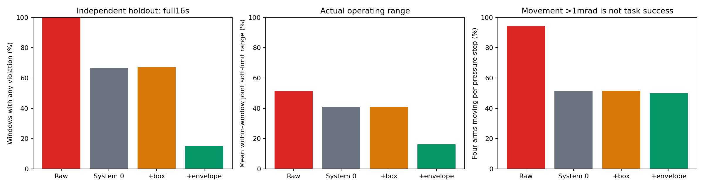

# 目标积压机制与独立随机留出

机制因子对照与独立留出：已完成768/768个16秒窗口，无效0，待完成0；192组全新外部随机轨迹。
独立留出原System 0违规128/192，积压限制候选违规29/192。同输入配对消除104条基线失败，候选新增5条失败。候选压力阶段四臂每步均移动>1mrad为50.00%，输出/外部命令L2总量比0.210；平均单窗口关节跨度16.18%、路径52.23rad。仍有违规，候选未通过安全准入，保持评测用途。 边际关节格不证明26维联合空间覆盖；周期末球距不证明连续接触、物体操作或实机安全。运动范围和全部失败并列展示，旧结果完整保留。
新机制：把持久目标限制在实测关节位置±0.050rad内，同时守住原0.025rad每步增量和软限位。包络本步不可达时只能逐步移向最近可达端点；旧目标仍按原FIFO交付，无队列抢占或目标瞬间重置。增量限制另列单因子，alpha作用于限幅后的输入；actor与安全预测参数冻结。
三个新种子152684921/198470327/237901613，每种子六臂对各8风险初态＋16广域稳定初态。四方法同初态、同全程外部输入，分别独立进程；严格6步FIFO（100ms）。全16秒计入安全分母，包括60步零输入；后900步四臂独立方向、异步保持，幅度0.005/0.015/0.025/0.05rad，保持1/4/15/30/90/180步。不删除失败，不根据留出结果调参。
初态库先于机制测试登记：143,808个几何候选、23,168条原地资格记录均保存；192个选择引用核验。初始保留球距≥1mm，1秒raw零输入无违规、漂移≤0.05rad、末速≤0.1rad/s。风险臂对起距20–60mm，general从95%软限位跨度LHS筛选；候选数不计入闭环窗口。

|方法|完整/计划|违规|>5mm|cross / self_F / self_U / table|四臂同时动|输出/命令L2|目标积压P95|平均关节跨度/路径|
|---|---:|---:|---:|---|---:|---:|---:|---:|
|无安全保护|192/192|192|192|[35, 185, 191, 192]|94.43%|1.0000|2.0725rad|51.40% / 172.87rad|
|原System 0动态512|192/192|128|112|[5, 35, 45, 102]|51.29%|0.5906|0.3503rad|40.97% / 130.28rad|
|System 0＋增量限制|192/192|129|115|[7, 34, 48, 104]|51.60%|0.5908|0.3489rad|40.99% / 130.51rad|
|System 0＋增量与积压限制|192/192|29|18|[2, 1, 4, 24]|50.00%|0.2101|0.0477rad|16.18% / 52.23rad|

四类失败可重叠。四臂活动量为随机输入发出后（第60步起）每控制步四臂关节位移L2均>1mrad；L2和P95为逐种子统计后平均，不是任务成功率或总体置信界。臂对暴露另列实际首随机目标到达后的第66步起统计。

## 配对失败变化

|种子|左 / 右|左独有失败|右独有失败|双方失败|双方通过|66步实际q前缀相同|最大q差rad|
|---|---|---:|---:|---:|---:|---|---:|
|152684921|无安全保护 / 原System 0动态512|23|0|41|0|False|0.307120|
|152684921|原System 0动态512 / System 0＋增量限制|2|5|39|18|True|0.000000|
|152684921|原System 0动态512 / System 0＋增量与积压限制|32|3|9|20|False|0.149011|
|152684921|System 0＋增量限制 / System 0＋增量与积压限制|34|2|10|18|False|0.149011|
|198470327|无安全保护 / 原System 0动态512|21|0|43|0|False|0.140459|
|198470327|原System 0动态512 / System 0＋增量限制|2|3|41|18|True|0.000000|
|198470327|原System 0动态512 / System 0＋增量与积压限制|33|0|10|21|False|0.051419|
|198470327|System 0＋增量限制 / System 0＋增量与积压限制|34|0|10|20|False|0.051419|
|237901613|无安全保护 / 原System 0动态512|20|0|44|0|False|0.107649|
|237901613|原System 0动态512 / System 0＋增量限制|4|1|40|19|True|0.000000|
|237901613|原System 0动态512 / System 0＋增量与积压限制|39|2|5|18|False|0.055801|
|237901613|System 0＋增量限制 / System 0＋增量与积压限制|37|3|4|20|False|0.055801|

## 臂对配额与真实压力

|臂对 / 方法|完整/24|违规|>5mm|≥3帧80mm：全窗/随机到达后|
|---|---:|---:|---:|---:|
|F_L-F_R / 无安全保护|24/24|24|24|24 / 24|
|F_L-U_L / 无安全保护|24/24|24|24|24 / 23|
|F_L-U_R / 无安全保护|24/24|24|24|24 / 24|
|F_R-U_L / 无安全保护|24/24|24|24|24 / 24|
|F_R-U_R / 无安全保护|24/24|24|24|24 / 23|
|U_L-U_R / 无安全保护|24/24|24|24|24 / 24|
|F_L-F_R / 原System 0动态512|24/24|19|18|24 / 24|
|F_L-U_L / 原System 0动态512|24/24|15|11|24 / 15|
|F_L-U_R / 原System 0动态512|24/24|15|11|24 / 23|
|F_R-U_L / 原System 0动态512|24/24|18|17|24 / 24|
|F_R-U_R / 原System 0动态512|24/24|16|15|24 / 24|
|U_L-U_R / 原System 0动态512|24/24|15|13|24 / 24|
|F_L-F_R / System 0＋增量限制|24/24|19|18|24 / 24|
|F_L-U_L / System 0＋增量限制|24/24|15|12|24 / 15|
|F_L-U_R / System 0＋增量限制|24/24|16|13|24 / 23|
|F_R-U_L / System 0＋增量限制|24/24|18|16|24 / 24|
|F_R-U_R / System 0＋增量限制|24/24|20|18|24 / 24|
|U_L-U_R / System 0＋增量限制|24/24|16|13|24 / 24|
|F_L-F_R / System 0＋增量与积压限制|24/24|1|0|24 / 24|
|F_L-U_L / System 0＋增量与积压限制|24/24|10|8|24 / 20|
|F_L-U_R / System 0＋增量与积压限制|24/24|2|0|24 / 22|
|F_R-U_L / System 0＋增量与积压限制|24/24|4|3|24 / 24|
|F_R-U_R / System 0＋增量与积压限制|24/24|5|3|24 / 24|
|U_L-U_R / System 0＋增量与积压限制|24/24|3|3|24 / 24|

## 原始开发回归与诊断

旧60317411取证重播64窗口，39违规；初态、命令、实际q、执行、裕量、控制/设备目标与旧测试逐帧一致，目标历史与真实FIFO逐帧一致。首次违规帧的危险行已被选中；32个桌面首次事件均无positive-cap结构行跳过。234个近失败线性可行性快照中9个不可行。已看到退让目标发出后，旧排队目标与惯性仍在闭合；这支持积压缓解实验，不能断言唯一根因。
32个桌面事件中30个在前12步曾有未入选帧；不能将碰撞时入选解释为整个预测区间都足够提前。17个涉及条件接触；9个线性不可行快照对应4个环境。全body速度和目标积压已保存；不能凭线性投影可行性推断物理安全。
- 旧60317411 System 0＋增量限制：38/64违规；重复旧外部随机轨迹，不增加独立指令数。
- 旧60317411 System 0＋增量与积压限制：9/64违规；重复旧外部随机轨迹，不增加独立指令数。
冻结候选另作64个重复观测窗口，q/输入/执行/裕量/目标均与开发候选逐帧一致，仍9违规（U自碰2、桌面7）。7/9个首次事件在已交付目标线性方向为打开时，实际距离速度仍闭合；54个近失败LP快照中15个不可行。积压限制仍未解决所有惯性与共同可行性问题。
该64窗口另计重复观测，不追加独立外部输入。54个LP快照中alpha/包络硬约束冲突为0，但15个安全行共同可行性失败；这与原baseline的234快照来自不同失败集合，不能直接按比例断言哪个求解器更差。

## 登记文件审计

附加取证第一次启动在仿真前发现旧PLAN.md说明文件hash与00:13登记不符（文件00:15修订），执行0窗口。原登记、失败manifest和双方hash保留于REGISTRATION_AUDIT.json；v2显式登记当前说明文件。所有取证执行代码、生产源码与actor hash均匹配，原重播物理结果逐帧相同；开发/留出冻结说明与参数未变。不能声称旧诊断说明文件从登记后一直未修改。

## 契约与限制

- 生产源码279项、actor、原配置保持冻结。候选仅在独立评测wrapper生效，未推广。
- actual actuator_target逐帧等于controller_target延后6步；目标软限位、真实增量、包络可达性用独立解析oracle核验。包络不可达比例和最大目标积压保留在逐条件results.json。
- 4项CPU契约覆盖积压累积、速率回收、500组独立标量边界oracle和非法状态；旧积分行为下积压测试RED，新机制GREEN。不是机械臂安全证明。
- 64窗口因果重播和128开发窗口单列；768留出配对窗口来自192组外部随机轨迹，不能相加声称896条独立轨迹。
- 没有查看留出结果后调参、重筛初态、排除失败或改变终点。范围与运动量按全部帧报告；UR周期姿态、26维联合操作空间、手指随机、连续网格/力学接触及真实物体任务未被此压力评测充分证明。
- 本批常规留出trace保存物理结果与目标契约；solver残差的精确因果审计仅在旧60317411重播保存，不冒称新留出每行都有该诊断。
- 所有旧safety_*字段逐位保留；不会替换旧安全和不安全曲线或视频。

