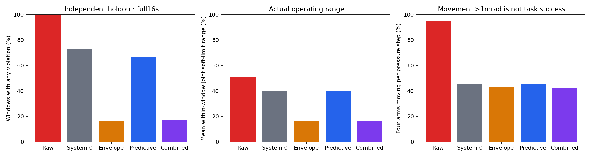

# 完整身体速度提前入选与全新随机留出

完整速度入选因子与全新初态/指令留出：960/960完整16秒窗口，无效0，待完成0；192组新初态与外部随机指令、五方法配对；完整批次提供全部192组轨迹与保护器放大视图。
原System 0动态512→完整速度提前入选：违规140/192→128/192，同输入救回18条、新增6条失败；平均实际关节跨度40.14%→39.78%。 固定积压限制→提前入选＋积压限制：违规31/192→33/192，同输入救回2条、新增4条失败；平均实际关节跨度16.02%→16.02%。 全部仍按原球距负值判失败，安全准入与资料交付分开。保留新增失败和操作范围代价，候选未推广；边际关节/末端格不证明26维联合空间或物体协同任务，控制周期球距不证明连续接触或实机安全。
新因子只增加安全行入选：使用在线完整身体速度，预测distance−horizon×正接近速度≤当前有效dmin＋10mm；cross/self/table时间0.16/0.40/0.30s，精确保留旧入选集合和瞬时关键行，动态预算2048，超限中止。投影、actor32、豁免及六步FIFO不改。旧固定±0.050rad积压限制单独复测并列组合；包络不可达时按原增量逐步回收，实际可暂超±0.050rad，由解析oracle核验，不瞬间重置目标。 违规按非豁免安全球距裕量<0判定，超过5mm指相对该阈值的不足，不等同真实网格或接触侵入深度。 软限位oracle核验发出的目标；实际关节状态不据此假定始终在软限位内。
新种子331047829/389116237/451902773，每种子六臂对各8风险初态＋16广域稳定初态；新的初态库，不复用上一批留出。五方法同初态、同全部外部随机输入，各自新进程；严格六步FIFO约100ms。全16秒计入安全分母，60步零输入＋900步压力；四臂独立方向和异步保持1/4/15/30/90/180步，幅度0.005/0.015/0.025/0.05rad。全部失败保留，参数在开发前冻结，不依留出结果调参。 记录dt=0.016666s，960步名义16秒；FIFO实际6×dt。raw沿用原无保护旁路，不受投影器约0.025rad/步速度盒限制；四个保护条件共享该限制，因此raw差异不能全部归因于安全约束。 已完整记录窗口的60步零前缀违规0，首随机目标实际到达前违规0；保护器可改变早期运动，实际66步q前缀是否一致另列。
初态库先于机制测试登记：139,840个几何候选、19,968条原地资格记录均保存；192个选择引用核验。初始保留球距≥1mm，1秒raw零输入无违规、漂移≤0.05rad、末速≤0.1rad/s。风险臂对起距20–60mm，general从95%软限位跨度LHS筛选；候选数不计入闭环窗口。

|方法|完整/计划|违规|>5mm|cross / self_F / self_U / table|四臂同时动|输出/命令L2|目标积压P95|平均关节跨度/路径|
|---|---:|---:|---:|---|---:|---:|---:|---:|
|无安全保护|192/192|192|192|[45, 186, 192, 192]|94.83%|1.0000|2.0416rad|51.02% / 170.16rad|
|原System 0动态512|192/192|140|118|[13, 29, 48, 117]|45.42%|0.5706|0.3392rad|40.14% / 125.47rad|
|固定积压限制|192/192|31|20|[1, 0, 5, 29]|43.02%|0.2025|0.0476rad|16.02% / 50.66rad|
|完整速度提前入选|192/192|128|105|[14, 23, 40, 105]|45.29%|0.5692|0.3403rad|39.78% / 125.25rad|
|提前入选＋积压限制|192/192|33|20|[2, 0, 4, 31]|42.65%|0.2023|0.0476rad|16.02% / 50.56rad|

四类失败可重叠。四臂活动量为随机输入发出后（第60步起）每控制步四臂关节位移L2均>1mrad；L2和P95为逐种子统计后平均，不是任务成功率或总体置信界。臂对暴露另列实际首随机目标到达后的第66步起统计。
raw沿用原无保护旁路；四个保护方法受原速度盒约0.025rad/步限制，raw不受这一盒限制。不能把raw对照的全部改善归因于安全行；本轮两因子的消融在相同原System 0限制下比较。速度盒单独作用另以独立登记的同GPU1补充对照检验，主五方法条件保持冻结，补充结果不混入主960分母。

## 配对失败变化

|种子|左 / 右|左独有失败|右独有失败|双方失败|双方通过|66步实际q前缀相同|最大q差rad|
|---|---|---:|---:|---:|---:|---|---:|
|331047829|无安全保护 / 原System 0动态512|12|0|52|0|False|0.130566|
|331047829|原System 0动态512 / 固定积压限制|45|1|7|11|False|0.056919|
|331047829|原System 0动态512 / 完整速度提前入选|7|3|45|9|False|0.000994|
|331047829|固定积压限制 / 提前入选＋积压限制|0|2|8|54|False|0.002838|
|331047829|完整速度提前入选 / 提前入选＋积压限制|38|0|10|16|False|0.056919|
|389116237|无安全保护 / 原System 0动态512|17|0|47|0|False|0.110295|
|389116237|原System 0动态512 / 固定积压限制|33|0|14|17|False|0.058417|
|389116237|原System 0动态512 / 完整速度提前入选|8|2|39|15|False|0.000015|
|389116237|固定积压限制 / 提前入选＋积压限制|1|0|13|50|False|0.000012|
|389116237|完整速度提前入选 / 提前入选＋积压限制|31|3|10|20|False|0.058417|
|451902773|无安全保护 / 原System 0动态512|23|0|41|0|False|0.211463|
|451902773|原System 0动态512 / 固定积压限制|33|1|8|22|False|0.173753|
|451902773|原System 0动态512 / 完整速度提前入选|3|1|38|22|False|0.000017|
|451902773|固定积压限制 / 提前入选＋积压限制|1|2|8|53|False|0.005139|
|451902773|完整速度提前入选 / 提前入选＋积压限制|30|1|9|24|False|0.173753|

## 臂对配额与真实压力

|臂对 / 方法|完整/24|违规|>5mm|≥3帧80mm：全窗/随机到达后|
|---|---:|---:|---:|---:|
|F_L-F_R / 无安全保护|24/24|24|24|24 / 24|
|F_L-U_L / 无安全保护|24/24|24|24|24 / 23|
|F_L-U_R / 无安全保护|24/24|24|24|24 / 23|
|F_R-U_L / 无安全保护|24/24|24|24|24 / 24|
|F_R-U_R / 无安全保护|24/24|24|24|24 / 24|
|U_L-U_R / 无安全保护|24/24|24|24|24 / 24|
|F_L-F_R / 原System 0动态512|24/24|19|17|24 / 24|
|F_L-U_L / 原System 0动态512|24/24|18|16|24 / 21|
|F_L-U_R / 原System 0动态512|24/24|19|14|24 / 22|
|F_R-U_L / 原System 0动态512|24/24|18|14|24 / 22|
|F_R-U_R / 原System 0动态512|24/24|17|15|24 / 17|
|U_L-U_R / 原System 0动态512|24/24|15|13|24 / 24|
|F_L-F_R / 固定积压限制|24/24|1|1|24 / 24|
|F_L-U_L / 固定积压限制|24/24|7|6|24 / 24|
|F_L-U_R / 固定积压限制|24/24|7|5|24 / 22|
|F_R-U_L / 固定积压限制|24/24|3|1|24 / 23|
|F_R-U_R / 固定积压限制|24/24|3|2|24 / 20|
|U_L-U_R / 固定积压限制|24/24|7|5|24 / 24|
|F_L-F_R / 完整速度提前入选|24/24|19|17|24 / 24|
|F_L-U_L / 完整速度提前入选|24/24|16|13|24 / 21|
|F_L-U_R / 完整速度提前入选|24/24|17|13|24 / 22|
|F_R-U_L / 完整速度提前入选|24/24|16|14|24 / 22|
|F_R-U_R / 完整速度提前入选|24/24|17|15|24 / 17|
|U_L-U_R / 完整速度提前入选|24/24|12|8|24 / 24|
|F_L-F_R / 提前入选＋积压限制|24/24|1|1|24 / 24|
|F_L-U_L / 提前入选＋积压限制|24/24|7|6|24 / 24|
|F_L-U_R / 提前入选＋积压限制|24/24|7|5|24 / 22|
|F_R-U_L / 提前入选＋积压限制|24/24|3|1|24 / 23|
|F_R-U_R / 提前入选＋积压限制|24/24|4|3|24 / 20|
|U_L-U_R / 提前入选＋积压限制|24/24|8|4|24 / 24|

## 首次违规前的实际操作

|方法|平均安全前缀秒|前缀平均关节跨度|前缀关节路径rad|
|---|---:|---:|---:|
|无安全保护|1.849|5.48%|9.89|
|原System 0动态512|8.886|25.59%|67.83|
|固定积压限制|14.518|14.78%|45.58|
|完整速度提前入选|9.569|26.90%|73.46|
|提前入选＋积压限制|14.499|14.74%|45.44|
首次负裕量的危险转移及其后所有运动从前缀指标排除；不同前缀长度同时报告，完整16秒运动指标仍保留。

## 二维关节边际访问

|方法 / 臂组|关节对数|平均 / 最少 / 最多已访格（每对100格）|
|---|---:|---:|
|无安全保护 / F_L–F_L|21|100.00 / 100 / 100|
|无安全保护 / F_L–F_R|49|100.00 / 100 / 100|
|无安全保护 / F_L–U_L|42|95.00 / 70 / 100|
|无安全保护 / F_L–U_R|42|95.00 / 70 / 100|
|无安全保护 / F_R–F_R|21|100.00 / 100 / 100|
|无安全保护 / F_R–U_L|42|95.00 / 70 / 100|
|无安全保护 / F_R–U_R|42|95.00 / 70 / 100|
|无安全保护 / U_L–U_L|15|89.67 / 67 / 100|
|无安全保护 / U_L–U_R|36|90.19 / 49 / 100|
|无安全保护 / U_R–U_R|15|89.67 / 67 / 100|
|原System 0动态512 / F_L–F_L|21|100.00 / 100 / 100|
|原System 0动态512 / F_L–F_R|49|100.00 / 100 / 100|
|原System 0动态512 / F_L–U_L|42|89.98 / 60 / 100|
|原System 0动态512 / F_L–U_R|42|90.07 / 60 / 100|
|原System 0动态512 / F_R–F_R|21|100.00 / 100 / 100|
|原System 0动态512 / F_R–U_L|42|89.83 / 60 / 100|
|原System 0动态512 / F_R–U_R|42|89.74 / 59 / 100|
|原System 0动态512 / U_L–U_L|15|78.40 / 48 / 100|
|原System 0动态512 / U_L–U_R|36|78.86 / 35 / 100|
|原System 0动态512 / U_R–U_R|15|77.80 / 47 / 100|
|固定积压限制 / F_L–F_L|21|98.76 / 96 / 100|
|固定积压限制 / F_L–F_R|49|98.18 / 93 / 100|
|固定积压限制 / F_L–U_L|42|83.38 / 57 / 98|
|固定积压限制 / F_L–U_R|42|85.00 / 55 / 100|
|固定积压限制 / F_R–F_R|21|97.86 / 93 / 100|
|固定积压限制 / F_R–U_L|42|82.90 / 56 / 97|
|固定积压限制 / F_R–U_R|42|84.24 / 53 / 98|
|固定积压限制 / U_L–U_L|15|69.73 / 47 / 90|
|固定积压限制 / U_L–U_R|36|70.17 / 34 / 92|
|固定积压限制 / U_R–U_R|15|70.00 / 45 / 95|
|完整速度提前入选 / F_L–F_L|21|100.00 / 100 / 100|
|完整速度提前入选 / F_L–F_R|49|100.00 / 100 / 100|
|完整速度提前入选 / F_L–U_L|42|90.19 / 60 / 100|
|完整速度提前入选 / F_L–U_R|42|90.07 / 60 / 100|
|完整速度提前入选 / F_R–F_R|21|100.00 / 100 / 100|
|完整速度提前入选 / F_R–U_L|42|90.14 / 60 / 100|
|完整速度提前入选 / F_R–U_R|42|89.69 / 57 / 100|
|完整速度提前入选 / U_L–U_L|15|78.93 / 49 / 100|
|完整速度提前入选 / U_L–U_R|36|79.06 / 35 / 100|
|完整速度提前入选 / U_R–U_R|15|77.67 / 47 / 100|
|提前入选＋积压限制 / F_L–F_L|21|98.62 / 95 / 100|
|提前入选＋积压限制 / F_L–F_R|49|98.20 / 93 / 100|
|提前入选＋积压限制 / F_L–U_L|42|83.36 / 57 / 98|
|提前入选＋积压限制 / F_L–U_R|42|84.98 / 55 / 100|
|提前入选＋积压限制 / F_R–F_R|21|97.81 / 93 / 100|
|提前入选＋积压限制 / F_R–U_L|42|82.86 / 56 / 97|
|提前入选＋积压限制 / F_R–U_R|42|84.19 / 53 / 98|
|提前入选＋积压限制 / U_L–U_L|15|69.80 / 47 / 90|
|提前入选＋积压限制 / U_L–U_R|36|70.17 / 34 / 92|
|提前入选＋积压限制 / U_R–U_R|15|69.93 / 45 / 95|
该二维格使用所有完整物理窗口含失败，超软限位样本不增加对应格。325个二维边际并不证明26维联合覆盖，UR周期同姿态未去重；补充指标在新压力留出前登记。
实际状态越软限位的关节样本比例（全窗口含失败）：无安全保护 1.8655%；原System 0动态512 0.8171%；固定积压限制 0.0658%；完整速度提前入选 0.8132%；提前入选＋积压限制 0.0660%。目标软限位通过不等于实际关节始终在软限位内；此处球距主要终点也不是实机安全认证。

## 16秒连续零指令对照（补充）

960/960完整窗口、无效0、待完成0；复用本轮192个初态、0新增随机指令，不与主压力分母混合。原三方法576在主压力部分结果可见后、自身结果前登记；补充两个新因子384在已有零/速度补充结果可见后、自身结果前登记。参数/初态不改，不依此重筛初态或排除主压力失败。
|方法|完整/192|违规|四类cross/F/U/table|保护非零输出窗口|最大实际关节漂移|
|---|---:|---:|---|---:|---:|
|无安全保护|192/192|0|[0, 0, 0, 0]|0|0.049987rad|
|原System 0动态512|192/192|0|[0, 0, 0, 0]|119|0.208052rad|
|固定积压限制|192/192|0|[0, 0, 0, 0]|119|0.248621rad|
|完整速度提前入选|192/192|0|[0, 0, 0, 0]|119|0.208049rad|
|提前入选＋积压限制|192/192|0|[0, 0, 0, 0]|119|0.248621rad|
完整960步严格零输入逐帧核验；raw issued目标每帧等于q0。1秒资格不等于16秒保证；保护器可主动退让，是否失败以原官方负裕量判定。所有失败和原始16秒数组保留，零指令结果不能外推为随机压力安全。

## 速度限制单独作用（同GPU补充对照）

仅限速192/192完整窗口、无效0、待完成0；配套raw/System0重复384/384，共576/576相关窗口。三方法均cuda:1；复用主实验192组初态和全部外部指令，0新增独立随机轨迹。主960条件未改变。仅限速按原vmax×dt裁剪增量，忽略actor门控与全部几何约束，原软目标限位/积分目标/FIFO保持。
补充登记时主压力部分结果已可见；仅限速在自身结果前登记，配套GPU1对照在仅限速运行完成但结果分析前登记。全三种子原样配套，没有依结果筛选。旧analyze_speed跨GPU0/GPU1比较仅作为审计保留，面板补充结论使用同GPU1三方法；不能假定跨GPU实际轨迹逐位相同。
|方法|完整/192|违规|>5mm|四类cross/F/U/table|平均关节跨度|平均安全前缀|前缀跨度|
|---|---:|---:|---:|---|---:|---:|---:|
|无安全保护|192/192|192|192|[45, 186, 192, 192]|51.02%|1.849s|5.48%|
|原System 0动态512|192/192|140|118|[13, 29, 48, 117]|40.14%|8.886s|25.59%|
|仅速度限制（无安全投影）|192/192|192|192|[39, 186, 191, 192]|48.90%|1.919s|5.61%|
|种子 / 左→仅速度限制|左独有失败|仅限速独有失败|双方失败|双方通过|
|---|---:|---:|---:|---:|
|331047829 / 无安全保护|0|0|64|0|
|331047829 / 原System 0动态512|0|12|52|0|
|389116237 / 无安全保护|0|0|64|0|
|389116237 / 原System 0动态512|0|17|47|0|
|451902773 / 无安全保护|0|0|64|0|
|451902773 / 原System 0动态512|0|23|41|0|
独立NumPy裁剪/目标积分/软限位及实际FIFO oracle逐960帧核验；安全行残差未计算，零占位不是几何可行性证据。比较为相关配对窗口，不给IID安全认证；完整安全与真实操作仍须同时审视。

## 预登记、开发与证据边界

旧开发离线估计：baseline58个首次分类失败事件中37个有预测关键帧未入选；旧积压限制9个事件中6个有此现象。缺失行使用后续有限差分速度（hindsight）和名义dmin，条件豁免可能使估计偏多，不能冒充当帧完整有效dmin下的线上验证。仅两个新预测方法使用当前完整身体速度，各帧验证旧行无丢失/预测关键行无遗漏；旧方法该指标未执行，其0数组只是占位。更早入选不等于动态安全保证。
新候选与三个种子均在候选开发结果之前冻结。bank登记不依随机策略结果；其全部候选和静置资格结果与192个选择引用可追溯。在线完整9021几何的d/closing/dmin非有限会中止，不以min统计隐藏非有限；原模型/配置/279项生产源码不变。
登记继承字段的历史说明与冻结说明稿残留见REGISTRATION_NOTE.md；当前真实设备以每条件argv/protocol为准，开发cuda:1，新留出cuda:0。原登记文件不做事后重写。
CPU独立集合oracle覆盖250组随机边界、异构批padding、接近/远离、有效dmin/豁免以及超容量中止，6项通过；旧静态union在相同提前入选契约上失败。旧积压限制wrapper使用原解析oracle逐帧核验。
旧候选9个首次事件中5个arm/full距离速度差≤1mm/s，不能把全部失败归因于未控身体速度；另外4个有差异但本比较不识别其来源，见RATE_DIAGNOSTIC.json。
开发60317411仅两个新因子128重复窗口，不计新增独立输入。旧因果重播仅离线解释，不加入本轮960分母。
已完成的队列目标预测实验另见[原独立面板](../safety_mechanism_20261005_causal_obs/)，其120/192→40/192来自不同机制、不同新指令且旧初态库，不与本轮合并。原有限性v2完整16秒评测、真实物体搬运/夹持与四臂任务仍为独立未完成策略关卡。
四臂均有独立随机外部命令；观察运动量和关节/末端边际访问，不能称为26维空间充分覆盖或四臂有目标任务成功。纯随机压力不替代物体尺寸/状态感知、真实接触力、抓持保持或实机安全。
全部旧scientific字段、队列证据独立面板与视频保留；本轮仅增加新字段与报告。所有大型原始数组在NAS，公开报告提供小型协议、参数、代码和hash。
- 旧开发 完整速度提前入选：37/64；状态complete，不删失败。
- 旧开发 提前入选＋积压限制：10/64；状态complete，不删失败。

