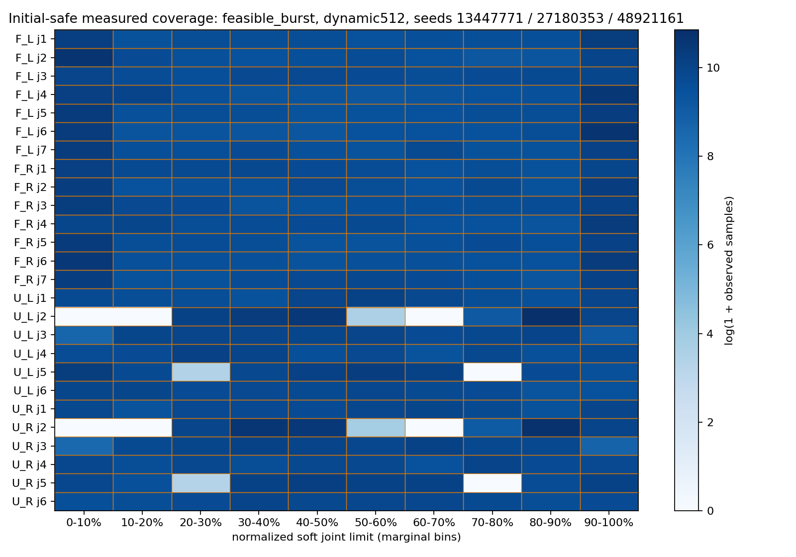

# 四臂强随机与操作空间覆盖

扩大随机范围：已完成1152个15秒窗口，容量失败576个，待完成384个。完成、无效和待完成分别统计，动态行候选尚未推广。

64环境×15秒/条件；四臂26关节独立方向；原三种子731923/2048171/9987031，新条件分布种子13447771/27180353/48921161。逐步IID指令或各臂独立保持1/4/15/30/90/180步；幅度档0.005/0.015/0.025/0.05rad。原初态扰动从±0.3扩大至±1.2rad，另采样归一化软限位[2.5%,97.5%]的随机LHS。每条件独立新进程，严格6步（100ms）FIFO；已完成配对的初态、初态标志和完整命令逐位核验。actor原32行和权重冻结；解析层原128行容量失败后新增动态完整临界行、硬预算512的候选。33登记条件共2112相关配对窗口，768条不同命令窗口；容量候选复用原输入，不增加独立样本。全域LHS是边际分层；条件分布按初始几何筛选；不报告IID安全置信区间。

条件初态：5888个候选，按采样次序取192个初态无违规且所有非豁免球距≥0.1mm的姿态；候选初态违规5693个。所有候选与选择标志均保留。未使用后续策略成败筛选；候选数量不加到15秒闭环测试样本。UR关节周期角会对应重复空间姿态。

原128行组9/9条件容量溢出，576个窗口无效，不能记为0违规。动态行预算512是评测候选，全部保留临界约束，actor不变。全域未筛选初态192个只有6个无违规，须与新增192个条件初态单列；条件初态合法不等于运动后安全。灰色关节分箱和未暴露臂对都是覆盖缺口。末端格数是实测访问量，范围框不等于可达空间体积；26关节边际覆盖不等于联合覆盖。本轮没有事后触发或按失败时刻停止。命令上限0.05rad；远处旁路可能超过普通求解器0.024999rad增量箱，实际越箱次数另存，不冒称全部限幅通过。测量仅控制周期末非豁免机器人/桌面安全球，不证明物体接触、抓持、连续碰撞或实机安全。尚有运行后违规时不能宣称System 0安全通过。

|随机来源|方法|完整窗口|初态违规|合法初态后违规|深度>5mm|容量失败|待完成|
|---|---|---:|---:|---:|---:|---:|---:|
|±1.2rad初态 + 逐步独立噪声|无安全保护|192/192|155/192|37/37|37|0|0|
|±1.2rad初态 + 逐步独立噪声|原固定128行 System 0|0/192|155/192|无完整合法初态窗口|0|192|0|
|±1.2rad初态 + 逐步独立噪声|动态行 System 0（实验候选）|192/192|155/192|10/37|9|0|0|
|±1.2rad初态 + 四臂异步保持|无安全保护|192/192|155/192|37/37|37|0|0|
|±1.2rad初态 + 四臂异步保持|原固定128行 System 0|0/192|155/192|无完整合法初态窗口|0|192|0|
|±1.2rad初态 + 四臂异步保持|动态行 System 0（实验候选）|0/192|0/0|无完整合法初态窗口|0|0|192|
|95%关节跨度初态（未筛选）+ 异步保持|无安全保护|192/192|186/192|6/6|6|0|0|
|95%关节跨度初态（未筛选）+ 异步保持|原固定128行 System 0|0/192|186/192|无完整合法初态窗口|0|192|0|
|95%关节跨度初态（未筛选）+ 异步保持|动态行 System 0（实验候选）|0/192|0/0|无完整合法初态窗口|0|0|192|
|95%跨度初态条件分布 + 异步保持|无安全保护|192/192|0/192|192/192|192|0|0|
|95%跨度初态条件分布 + 异步保持|动态行 System 0（实验候选）|192/192|0/192|115/192|102|0|0|

## 科研口径与证据

- 预登记PLAN、CAPACITY_PLAN、FEASIBLE_PLAN与各campaign_plan保留。原128行失败不被扩容候选替换；actor32输入不变，没有修改生产安全代码或学习权重。
- 三条CPU随机流分别产生方向、保持时间、幅度档；初态另用派生种子。逐步IID源输入无状态反馈；异步保持源有时间相关性，不能叫逐帧IID。
- 同种子wide_iid/wide_burst复用初态；System 0扩容复用原命令；新条件分布的192条命令使用新种子。768条不同命令窗口也不是IID可靠性样本。
- 19项CPU契约通过，覆盖分层/裁剪、源复现、四臂异步、真实FIFO、真实子进程隔离、exit0但协议失败、源漂移、128行溢出与动态行无丢弃、覆盖统计。不是19项系统安全证明。
- 真实模拟全部完整窗口逐位核验命令、初态、6步FIFO；所有配对初态flag一致；所有完结条件的checkpoint、源码、解析配置、协调器、backstop相同。
- 图形设备枚举日志曾报错，但几何bank完整产物核验通过。GPU1闭环显式cuda:1、两设备可见；GPU0原条件另列。配对在同GPU，不声称跨GPU动态前缀逐位相同。
- 软限位[2.5%,97.5%]跨度是关节边际范围。UR周期角可能对应同一空间位置，未计算26维可达/无碰撞空间覆盖率。
- 面板默认只显示初態无违规窗口的实际覆盖，仍包含后续失败；初始分箱与实测分箱分别统计，超软限位实测q不裁入范围。完整all_coverage另存。
- 末端10cm实测体素、包围框和六臂对风险暴露用于发现覆盖洞，不把包围框当体积覆盖分母；接近/远离/切向标签依据末端，不代表最近球对的速度。臂对探针为球面几何余量，包含豁免球对；官方违规以上方四通道非豁免判定为准。
- 新条件初态三组在第一条随机指令到达前（前6步）raw/System 0分别8/5/5个窗口越界；这些失败保留在192分母内。静态球距合法不保证物理初态稳定，不能只归因于安全策略响应。
- bank全部5888候选、192选取、其余拒绝和多余合格记录保留在NAS；候选不计闭环窗口。选取只用初始几何，不用后续安全结果。
- 原始NPZ、输入tape、全部候选、日志保留在NAS实验目录；网页公开全部协议、源hash、JSON episode、CSV汇总和可下载图件，未上传NPZ。
- 强输入0.05rad/步高于普通求解器箱0.024999rad/步。记录实际目标增量和越箱次数；不把远处旁路默认算成限幅通过。
- 未完成窗口保留“待完成”，无效窗口保留“容量失败”，不在安全分母内。没有物体、接触力、连续碰撞或实机验收。

全结果见[results.json](results.json)，逐条件见[windows.csv](windows.csv)。实际状态：running。
