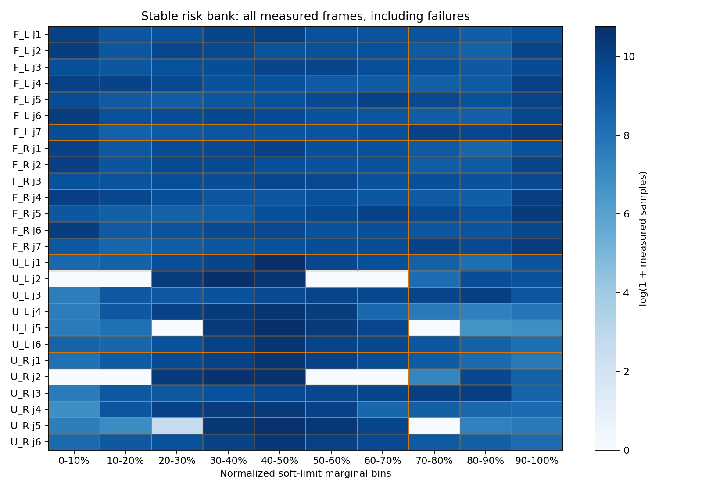

# 六组臂对风险与初态稳定性实验

六组臂对定额压力测试：已完成384/384个16秒配对窗口，无效0，待完成0。

三个新种子60317411/80692357/109441003；每种子六组臂对各8个风险初态＋16个广域稳定初态。64环境，前60步零输入＋900步四臂独立方向、异步保持；幅度0.005/0.015/0.025/0.05rad，保持1/4/15/30/90/180步。每条件独立进程，严格6步FIFO（100ms），actor32行与权重冻结，保护器动态完整临界行硬预算512。全部16秒作为安全分母，不删除初态准备后重现的失败。

初态准入：所有保留桌面球距和非豁免机器人球距≥1mm，再经1秒零输入检查，违规为0、漂移≤0.05rad、末步速度≤0.1rad/s。146,496个几何候选、22,592个原地检查记录均保存，192个初态的选择引用全部核验。候选数不计入闭环样本；只筛初态和零输入稳定性，未读取后续随机策略结果。

风险初态按20–60mm臂对球面余量定向搜索，是条件压力分布；广域组从95%关节跨度LHS条件筛选。它们与旧纯随机组分别报告，不把初态准备改善当作安全策略提升。六臂对实际80mm暴露仍须逐组核验；风险探针包含豁免球对，官方安全结论按四类非豁免余量。保留所有失败，仍有违规就不能宣布System 0安全通过。仅证明已测控制周期末球距表现，不证明26维联合空间、连续碰撞、物体接触或实机安全。

|初态分层|方法|完整窗口|违规|>5mm|零输入前缀违规|随机目标到达前违规|
|---|---|---:|---:|---:|---:|---:|
|全部风险分层|无安全保护|144/144|144|144|0|0|
|广域稳定初态|无安全保护|48/48|48|48|0|0|
|全部风险分层|System 0动态完整行候选|144/144|99|90|0|0|
|广域稳定初态|System 0动态完整行候选|48/48|23|21|0|0|

|风险初态臂对|方法|完整窗口|3帧80mm：全窗/随机目标到达后|违规|>5mm|
|---|---|---:|---:|---:|---:|
|F_L-F_R|无安全保护|24/24|24/24|24|24|
|F_L-U_L|无安全保护|24/24|24/22|24|24|
|F_L-U_R|无安全保护|24/24|24/24|24|24|
|F_R-U_L|无安全保护|24/24|24/23|24|24|
|F_R-U_R|无安全保护|24/24|24/24|24|24|
|U_L-U_R|无安全保护|24/24|24/24|24|24|
|F_L-F_R|System 0动态完整行候选|24/24|24/24|16|14|
|F_L-U_L|System 0动态完整行候选|24/24|24/20|17|13|
|F_L-U_R|System 0动态完整行候选|24/24|24/23|19|18|
|F_R-U_L|System 0动态完整行候选|24/24|24/20|14|14|
|F_R-U_R|System 0动态完整行候选|24/24|24/19|17|17|
|U_L-U_R|System 0动态完整行候选|24/24|24/24|16|14|

全窗80mm暴露是预登记口径，另补充首次随机目标到达后（第66步后）的同阈值暴露，避免只靠初态/零输入阶段声称随机压力风险覆盖。该补充统计不影响初态选择、主安全分母或已登记暴露判定。

## 零输入诊断（旧分布，独立于新增384窗口）

三个旧初态库共192窗口，26关节零输入且目标恒定，20窗口仍违规；19初态含条件豁免桌面球层重叠，14窗口负桌面余量的豁免撤回。零时钟刷新q、球心、flag逐位一致，未证实简单缓存刷新可以解决。原amp=0 CLI在启动仿真前被拒绝，三个失败日志保留，计0诊断窗口；v2 nominal amp=.05但真实tape全零，完整192窗口另计。

## 核验与边界

- 原地准入属于实验初始化；生产安全核心、actor、配置保持冻结，动态512是未推广的评测候选。
- 每个风险重启最多取一个姿态；全部候选、拒绝、稳定性结果和选择引用保留。不同种子共享同一模拟场景与模型，不报IID置信界。
- 命令、初态、FIFO、源hash和解析配置核验；实际越普通求解器增量箱的次数保留在逐条件results，不假称所有指令被限幅。
- 两项新增CPU契约验证零前缀保留全部随机后缀、配额不足/策略结果筛选拒绝；不把它们当安全证明。上一轮19项契约不重复计数。
- 后续失败的窗口全部留在主16秒分母，包含零输入和延迟前缀；官方违规与包含豁免球对的风险探针分开。
- 旧1536完整／576容量无效窗口及全部旧面板字段保持原样。新增192不同指令窗口对应384相关配对窗口，零输入诊断和bank候选分开。
- 原始NPZ与完整候选在NAS，网页公开协议/源hash/完整episode JSON/CSV/标准图件。尚未做连续时间、物体感知/抓持和实机验收。
- 距离曲线在每种子/分层中分别取最低环境编号的raw失败保护通过、保护仍失败，公开选择规则；它是结果分类示例，不是预登记的额外安全检验，不影响完整分母。

[完整结果](results.json) · [逐条件CSV](windows.csv) · [预登记](RISK_PLAN.md) · [零输入结果](zero_results.json)

## 配对外部输入与实际观测前缀

初态和外部命令一致不保证实际q前缀一致：保护器可能对零输入也产生避险增量。这里保存随机首目标到达前66步的真实差值，不冒称双方在随机压力开始时状态相同。

|种子|初态/命令逐位一致|66步q前缀逐位一致|最大q差(rad)|raw单独失败|保护单独失败|双方失败|
|---|---|---|---:|---:|---:|---:|
|risk_60317411_raw|是|False|0.348623|25|0|39|
|risk_80692357_raw|是|False|0.141020|23|0|41|
|risk_109441003_raw|是|False|0.194511|22|0|42|

## 实际执行量与强随机输入

|条件|压力阶段四臂同时动(>1mrad)|输出/命令L2总量比|零输入仍有保护输出的窗口|零前缀最大q漂移(rad)|四类违规 cross/F/U/table|
|---|---:|---:|---:|---:|---|
|risk_60317411_raw|95.24%|1.0000|0|0.049951|[12, 60, 64, 64]|
|risk_60317411_system0|47.18%|0.5742|43|0.345356|[3, 6, 17, 32]|
|risk_80692357_raw|95.93%|1.0000|0|0.049939|[10, 64, 64, 64]|
|risk_80692357_system0|45.44%|0.5734|42|0.137231|[2, 7, 14, 37]|
|risk_109441003_raw|94.78%|1.0000|0|0.049792|[15, 61, 64, 64]|
|risk_109441003_system0|43.70%|0.5686|40|0.197722|[3, 8, 19, 30]|

按全部900步实际外部cmd报告26关节逐关节最小/最大、逐窗口双符号比例、保持时长与幅度档更新次数，见results.json；这些是边际输入统计，不冒称覆盖26维联合操作空间。风险初态搜索改变初态分布，后续指令保持状态独立随机。各四类违规可重叠，不能相加当唯一失败数。
