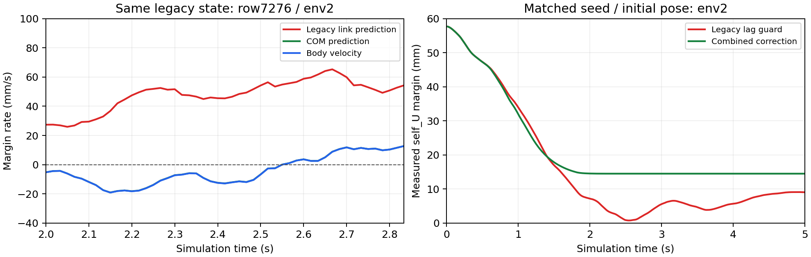
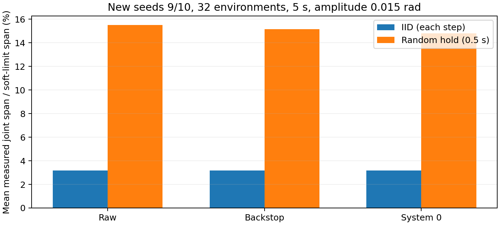
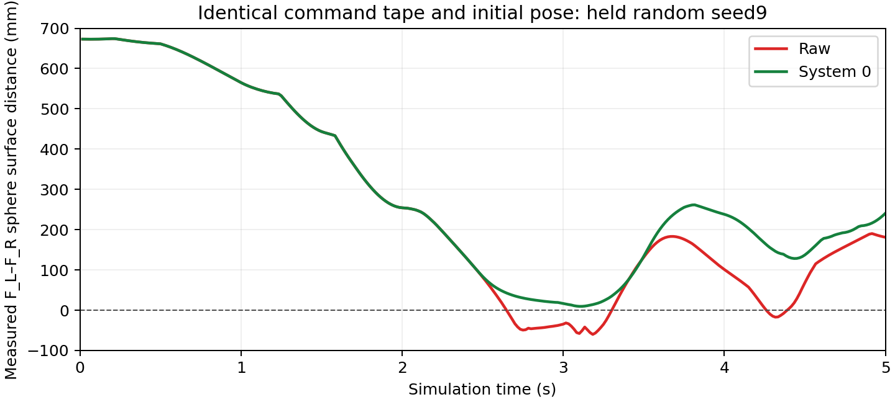

# 质心参考点、约束覆盖与纯随机压力测试

最新候选 `duo_env_a31_priority_guard.yaml`。checkpoint SHA256 `4dc303940d9fa6de2dbdf1e38599e7219ec3e816179a0884920826be46abd0d6`。

三个改动：球心雅可比改用PhysX质心参考点；兜底按150ms预测边界余量选择约束；条件性桌面接触仍保留正cap阻尼。actor checkpoint及原32行观测、碰撞球与速度上限不变。

## 冻结随机组

|分布/方法|条件|违规/窗口|最小臂/手球距mm|平均关节范围|六臂对暴露|执行/指令|
|---|---|---:|---:|---:|---:|---:|
|逐步 IID 随机 · 无保护|seed 9,10 · 5s · 保持0.02s|2/64|-36.467|3.18%|0/6|1.000|
|逐步 IID 随机 · 仅解析兜底|seed 9,10 · 5s · 保持0.02s|0/64|23.081|3.17%|0/6|1.000|
|逐步 IID 随机 · System 0|seed 9,10 · 5s · 保持0.02s|0/64|23.081|3.17%|0/6|1.000|
|纯随机保持 · 无保护|seed 9,10 · 5s · 保持0.50s|62/64|-81.031|15.51%|2/6|1.000|
|纯随机保持 · 仅解析兜底|seed 9,10 · 5s · 保持0.50s|0/64|8.522|15.16%|3/6|0.979|
|纯随机保持 · System 0|seed 9,10 · 5s · 保持0.50s|0/64|9.588|14.80%|3/6|0.958|
|纯随机保持 · 无保护|seed 11 · 10s · 保持1.50s|32/32|-87.754|32.58%|2/6|1.000|
|纯随机保持 · System 0|seed 11 · 10s · 保持1.50s|1/32|-32.679|27.78%|2/6|0.825|

## 回归与审计

新候选共完成512个保护窗口，违规1，超过5mm的非豁免球重叠1，初态违规0。按通道：{'cross': 0, 'self_F': 1, 'self_U': 0, 'table': 0}。最小臂间余量-32.679mm。
短保持随机的旧/新 System0 为 1/64 → 0/64；新增失败条件0。所有纯随机配对的命令SHA和初态均逐条验证相同。
保留 com_candidate/selection_diagnostic 仅COM修正导致4/32违规的负结果；重复诊断不加算独立安全窗口。旋转点与条件接触均保存RED→GREEN日志，相关CPU回归74项通过。

## 范围与限制

平均关节范围 = 各关节实测max-min / 该关节soft-limit跨度，再对关节及窗口平均。六臂对暴露是至少一步进入80mm的跨窗口并集，不等于每条轨迹覆盖六对。
最小臂/手球距取 cross/self_F/self_U 三通道，包含本臂手部与本臂连杆，并不只统计臂与另一条臂。桌面使用非豁免违规计数，不能与该距离混用。
逐步IID噪声与纯随机保持是不同分布，保持时间为0.5秒及1.5秒；后者时间相关。所有关节方向随机且无目标点引导，但不等于姿态空间或危险状态均匀采样。
初态、桌面/基座几何与动力学仍固定；未覆盖随机初始姿态、参数扰动、通信延迟、真实物体协作成功、接触力和实机。零球层违规不是全面安全证明。
bounded active set仍可能遗漏复杂多接触状态；保留最小余量和运动量，不能仅用违规率判断改进。

完整清单、源码hash及每窗口配对见results.json、protocols与paired_random.csv；诊断过程见DIAGNOSIS.md。

## 回归分组

|分组|条件|违规/窗口|最小臂/手球距mm|平均关节路径rad|
|---|---|---:|---:|---:|
|四臂同时工作空间漫游|seed8 · 5s · amp0.015|0/32|1.922|28.556|
|六臂对分层压力|seed0–3 · 5s · amp0.005/0.015|0/256|11.732|6.347|
|六臂对延长窗口|seed0 · 10s · amp0.015|0/32|10.984|7.995|
|四臂定向冲突|seed8 · 5s · amp0.015|0/32|12.834|12.535|

## 可视化

补充重播用于取完整球心以画臂间球距，未加入独立样本总数；选择规则为seed9中原F_L–F_R球距最小的窗口。
